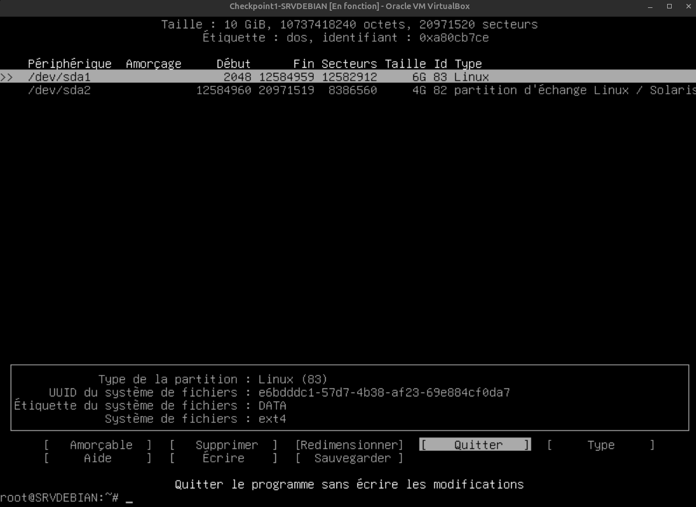
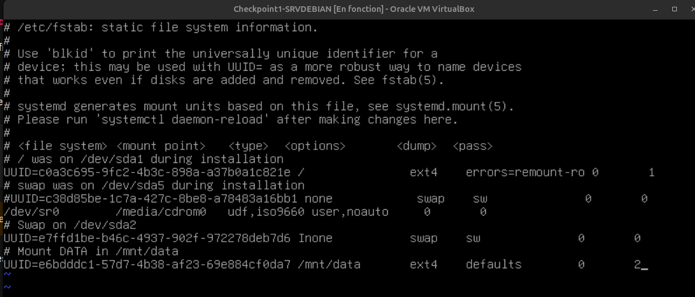

## Exercice 1 - Gestion du stockage

Login en root sur la VM Debian

Affichage des disques sur le système :
    fdisk -l

2 disques /dev/sda et /dev/sdb

/dev/sdb contient 3 partitions dont une d'amorçage et le swap. C'est le disque système.

La création et le formatage des partitions doit se faire sur /dev/sda

    cfdisk /dev/sda

Selectionner un type d'étiquette "DOS" puis selectionner "nouvelle" partition et ensuite "6G" pour la taille de la partition (choisir primaire)

La partition /dev/sda1 est créé et l'espace libre restant pour la partition de Swap est de 4G

Ecrire puis quitter

formatage de la partition en ext4 avec le nom de la partition "DATA":

    mkfs.ext4 -L DATA /dev/sda1
    

Pour visualiser la création de la partition

    df -h
    
    
---------------------

Création de la partition pour le swap :

    fdisk /dev/sda
    
taper m pour obtenir de l'aide

n pour une nouvelle partition

p pour partition primaire

2 pour numéro de partition

valeur par défaut pour les secteurs

puis on change le type de partition de Linux vers Swap grace à "t", "L" pour afficher tous les codes puis "82" pour "fichier d'échange"

Taper W pour sortir et écrire la table de partition

Formatage de la partition Swap:

    mkswap /dev/sda2
    cfdisk (pour vérifier que tout s'est bien passé)
    
Activation du Swap :

    swapon /dev/sda2
    swapon -s (pour vérifier l'activation du swap)
    
------------------------

Montage de la partition DATA

Création du repertoire de montage

    mkdir /mnt/data
    mount -t ext4 /dev/sda1 /mnt/data

Pour les montages automatique au démarrage de la machine :

Récupération du UUID de /dev/sda1 et sda2 avec cfdisk
Edition du fichier /etc/fstab (avec unecopie de secours avant modification)

    cp fstab fstab.tmp
    vi /etc/fstab
 
 
 
Pour désactiver le swap du 1er disque, mettre en commentaire avec # la ligne sous #swap was on /dev/sda5

Pour monter la partition DATA, ajouter le UUID de /dev/sda1 a monter sur /mnt/data dans le fichier fstab
Pour activer le nouveau Swap, ajouter le UUID de /dev/sda2 dans fstab

--------------------------

Images de la solution :

Affichage de cfdisk après formatage des partitions

Vérification du montage de la partition DATA

Vérification de l'activation du Swap

Fichier fstab

    

